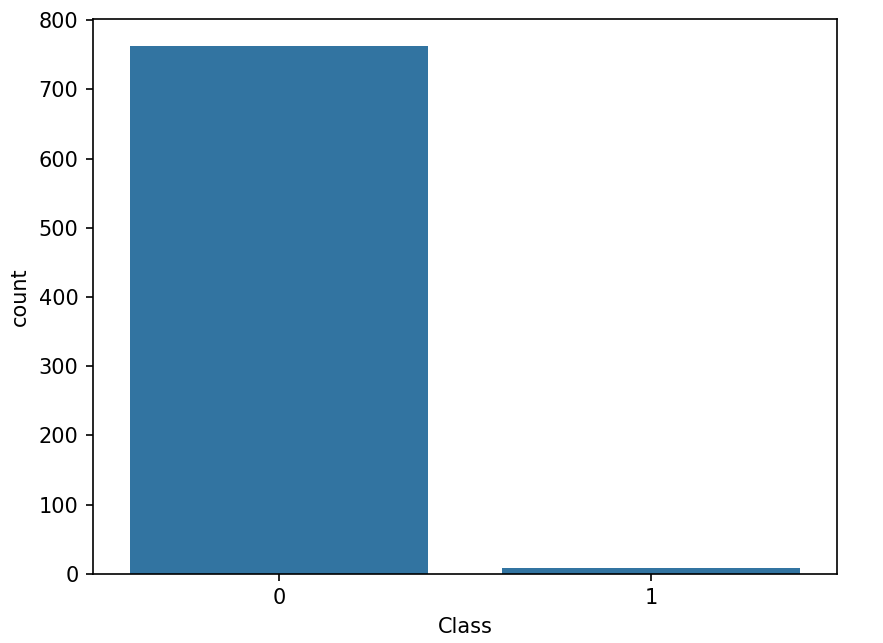

## SAMPLING 

Sampling is the **process of selecting a subset of elements** from a larger population to represent and analyze, often used in research or statistics to draw conclusions about the entire group based on the sampled data.

## Dataset
The dataset used in this project is available in Creditcard_data.csv. It contains the following columns:

**Time**: Number of seconds elapsed between this transaction and the first transaction in the dataset.  
**V1-V28**: Principal components obtained with PCA, anonymized features.  
**Amount**: Transaction amount.  
**Class**: Target variable indicating whether the transaction is fraudulent (1) or not (0).  

## Plot

## Sampling Techniques Used
**RandomUnderSampler**  :A method that randomly removes instances from the majority class to balance class distribution in imbalanced datasets.  
**RandomOverSampler**  :A technique that randomly duplicates instances from the minority class to balance class distribution in imbalanced datasets.  
**SMOTE (Synthetic Minority Over-sampling Technique)**  :A method that generates synthetic samples in the minority class by interpolating between existing instances to address class imbalance.  
**BorderlineSMOTE**  :A variation of SMOTE that focuses on generating synthetic samples near the borderline between classes to address imbalanced datasets.  
**ADASYN (Adaptive Synthetic Sampling)**  :A technique similar to SMOTE but adjusts the sampling density based on the level of difficulty of learning areas to generate more informative synthetic samples.  

## Classifier Used
**LogisticRegression** :A linear model used for classification that predicts the probability of an instance belonging to a particular class.   
**DecisionTreeClassifier**  :A non-parametric model that makes decisions based on a tree-like structure, learning simple decision rules inferred from the data features.   
**RandomForestClassifier**  :An ensemble learning method that constructs multiple decision trees during training and outputs the class that is the mode of the classes of the individual trees.  
**SVC (Support Vector Classifier)**  :A classifier that finds the hyperplane that best separates classes in a high-dimensional space by maximizing the margin between classes.  
**GradientBoostingClassifier**  : A boosting ensemble method that builds a strong classifier by combining multiple weak classifiers in a stage-wise manner, minimizing the loss function's gradient.  

we are generating 5 Datasets using above mentioned sampling techniques and then we calculate accuracy for predicted data for each model. Result is stored in **final.csv**.